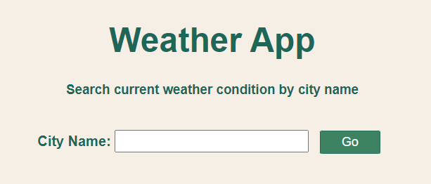

# weather-by-city

This app is built using HTML, CSS, NodeJS, ExpressJS, OpenWeatherAPI.

User can search for the current weather condition of any city in the world by simply typing the name of the city.

